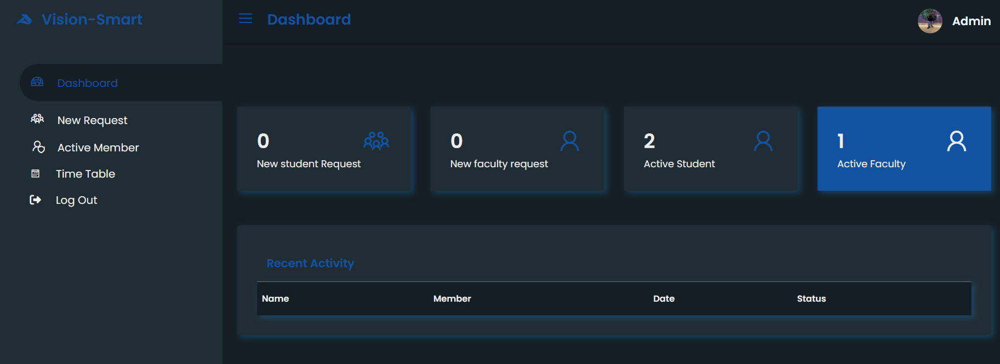
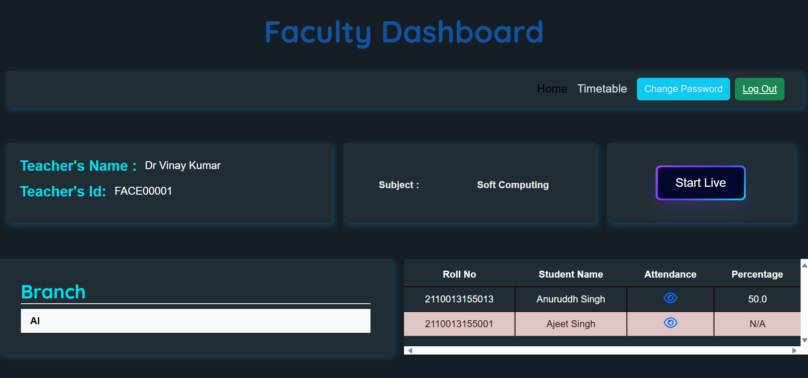
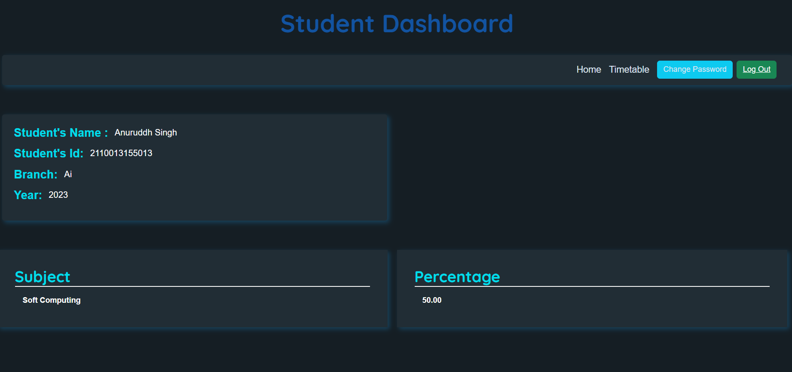

# Vission Smart Attendance System

## Overview

The Vission Smart Attendance System is a web application designed to streamline and automate the process of recording and managing attendance using facial recognition technology. It is built using Flask for the backend and integrates various templates and static resources to create a user-friendly interface.

## Features

- **User Authentication**: Secure login for students, faculty, and administrators.
- **Facial Recognition**: Automated attendance marking using facial recognition.
- **Admin Dashboard**: Manage faculty, students, and attendance records.
- **Faculty Dashboard**: View attendance, manage timetables, and open camera for attendance marking.
- **Student Dashboard**: View personal attendance records and update profile information.

## Project Structure

```markdown
Vission_smart_Attendance_System/
├── flask_project/
│   ├── website/
│   │   ├── __init__.py
│   │   ├── auth.py
│   │   ├── views.py
│   │   ├── models.py
│   │   ├── static/
│   │   │   ├── css/
│   │   │   ├── js/
│   │   │   ├── images/
│   │   │   └── faces/
│   │   ├── templates/
│   │   │   ├── admin_dashboard/
│   │   │   ├── faculty_dashboard/
│   │   │   ├── student_dashboard/
│   │   │   └── auth/
│   │   ├── utils/
│   │   │   └── recognition.py
│   │   ├── config.py
│   │   └── run.py
├── requirements.txt
└── README.md
```

## Installation

1. **Clone the repository**:
   ```bash
   git clone https://github.com/AnuruddhSin/Vission_smart_Attendance_System.git
   cd Vission_smart_Attendance_System
   ```

2. **Create and activate a virtual environment**:
   ```bash
   python3 -m venv venv
   source venv/bin/activate
   ```

3. **Install the dependencies**:
   ```bash
   pip install -r requirements.txt
   ```

4. **Set up the database**:
   ```bash
   flask db init
   flask db migrate -m "Initial migration."
   flask db upgrade
   ```

5. **Run the application**:
   ```bash
   flask run
   ```

## Configuration

Modify the `config.py` file to set up your database URI, secret key, and other configurations.

## Usage

1. **Admin**:
   - Manage faculty and students.
   - View and edit attendance records.
   - Manage timetables.

2. **Faculty**:
   - Mark attendance using the facial recognition system.
   - View personal attendance records.
   - Manage timetables.

3. **Students**:
   - View personal attendance records.
   - Update profile information.

## Screenshots

### Admin Dashboard


### Faculty Dashboard


### Student Dashboard


## Contributing

Contributions are welcome! Please fork the repository and submit a pull request for review.

## License

This project is licensed under the MIT License. See the LICENSE file for more details.

## Acknowledgements

- OpenCV for the facial recognition implementation.
- Flask for the web framework.
- Bootstrap for the front-end components.

---

For any inquiries or support, please contact anuruddh7234@gmail.com.
```

Ensure that the images `admin_dashboard.png`, `faculty_dashboard.png`, and `student_dashboard.png` are located in the `flask_project/website/static/images/` directory. Replace the paths in the markdown with the actual paths to the images in your project directory. If the images are located in a different path, update the paths accordingly.
